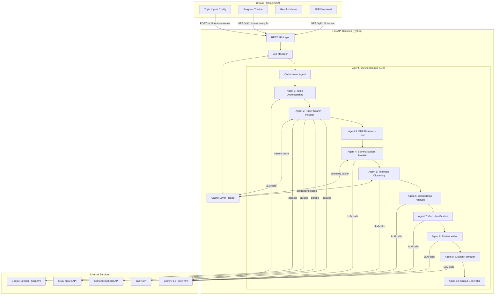
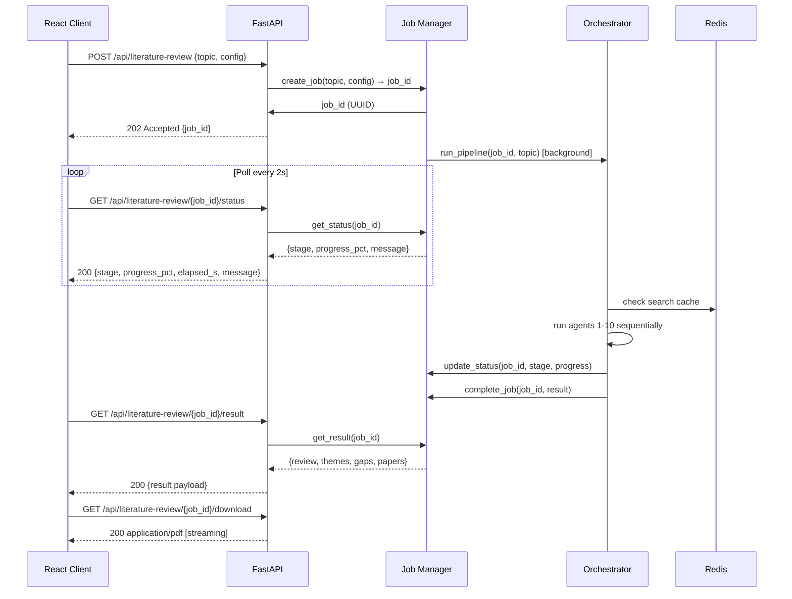

# Design Document: Literature Review Web Application

## Overview

This document describes the technical design for converting the existing Jupyter notebook multi-agent literature review system into a production-ready web application. The system enables researchers to submit a research topic through a React UI, which triggers a backend pipeline of 10 specialized AI agents orchestrated via Google ADK. Results are returned as a structured literature review with a downloadable PDF.

### Key Design Goals

- **Async-first**: Every I/O-bound operation (API calls, LLM inference, file I/O) uses Python `asyncio` to maximize concurrency.
- **Job-based model**: Reviews are long-running background jobs. Clients poll for status rather than holding an open connection.
- **Cache-before-compute**: Redis caches search results, embeddings, and LLM summaries to avoid redundant work on repeat topics.
- **Agent isolation**: Each agent is a stateless module that consumes immutable input and returns a result; shared mutable state is eliminated.
- **Sub-2-minute target**: Achieved through parallel agent execution, concurrent API calls, and aggressive caching.

### Research Findings

The following findings from the existing notebook and external research inform this design:

- **Google ADK parallel/sequential patterns**: The notebook already uses `ParallelAgent` and `SequentialAgent` from `google.adk.agents`. These patterns are preserved in the production architecture.
- **arXiv API**: Free, no authentication required. Use the `arxiv` Python library (`arxiv>=2.1.0`) for typed results.
- **Semantic Scholar API**: Free tier with 100 req/5 min; authenticated tier at 1 req/sec. Use `semanticscholar` Python library.
- **IEEE Xplore API**: Requires institutional or paid API key. Use the REST API with `httpx` async client.
- **Google Scholar / SerpAPI**: The `scholarly` library scrapes Scholar (fragile, blocked frequently); SerpAPI is the reliable paid alternative. Design accommodates both via an adapter pattern.
- **Redis caching**: `redis-py` with `aioredis` for async-compatible caching. TTL of 24 hours for search results per requirements.
- **PDF generation**: `reportlab` is already used in the notebook. For richer output with table-of-contents and page numbers, `weasyprint` (HTML→PDF) or `fpdf2` are alternatives. Design uses `reportlab` to minimize new dependencies.
- **FastAPI background tasks**: FastAPI's `BackgroundTasks` handles short async jobs. For heavier workloads, `celery` + Redis is the production approach. Design uses FastAPI `BackgroundTasks` for the initial implementation with a Celery upgrade path noted.
- **Gemini 2.5 Flash**: `gemini-2.5-flash` offers the best latency/quality tradeoff for the summarization and analysis agents.

---

## Architecture

The system follows a three-tier architecture: React SPA → FastAPI Backend → Multi-Agent Pipeline.



### Request Lifecycle



---

## Components and Interfaces

### Directory Structure

```
literature-review-web-app/
├── backend/
│   ├── agents/
│   │   ├── __init__.py
│   │   ├── topic_understanding.py     # Agent 1
│   │   ├── paper_search.py            # Agent 2 (parallel sub-agents)
│   │   ├── pdf_retrieval.py           # Agent 3 (loop agent)
│   │   ├── summarization.py           # Agent 4 (parallel)
│   │   ├── thematic_clustering.py     # Agent 5
│   │   ├── comparative_analysis.py    # Agent 6
│   │   ├── gap_identification.py      # Agent 7
│   │   ├── review_writer.py           # Agent 8
│   │   ├── citation_formatter.py      # Agent 9
│   │   ├── output_generator.py        # Agent 10
│   │   └── orchestrator.py            # Master coordinator
│   ├── tools/
│   │   ├── __init__.py
│   │   ├── arxiv_search.py
│   │   ├── semantic_scholar_search.py
│   │   ├── ieee_search.py
│   │   ├── scholar_search.py
│   │   ├── pdf_extractor.py
│   │   ├── clustering.py
│   │   ├── citation_formatter.py
│   │   └── pdf_generator.py
│   ├── models/
│   │   ├── __init__.py
│   │   ├── paper.py                   # Paper, Theme, ResearchGap
│   │   ├── job.py                     # Job, JobStatus, JobResult
│   │   └── api.py                     # Request/response Pydantic models
│   ├── services/
│   │   ├── __init__.py
│   │   ├── job_manager.py             # Job lifecycle management
│   │   ├── cache_service.py           # Redis / in-memory cache
│   │   └── pipeline_runner.py         # Async pipeline execution
│   ├── config/
│   │   ├── __init__.py
│   │   ├── settings.py                # Pydantic Settings (env vars)
│   │   └── logging_config.py
│   ├── utils/
│   │   ├── __init__.py
│   │   ├── retry.py                   # Exponential backoff decorator
│   │   ├── deduplication.py           # DOI/title dedup logic
│   │   └── correlation.py             # Correlation ID middleware
│   ├── api/
│   │   ├── __init__.py
│   │   ├── routes/
│   │   │   ├── literature_review.py   # /api/literature-review routes
│   │   │   └── health.py              # /api/health
│   │   └── middleware.py              # CORS, logging, correlation ID
│   ├── main.py                        # FastAPI app factory
│   ├── requirements.txt
│   └── Dockerfile
├── frontend/
│   ├── src/
│   │   ├── components/
│   │   │   ├── TopicForm.tsx
│   │   │   ├── ProgressTracker.tsx
│   │   │   ├── ResultsViewer.tsx
│   │   │   └── ErrorBanner.tsx
│   │   ├── hooks/
│   │   │   └── useJobPoller.ts        # Polling hook
│   │   ├── api/
│   │   │   └── client.ts              # Typed API client
│   │   ├── App.tsx
│   │   └── main.tsx
│   ├── package.json
│   ├── Dockerfile
│   └── nginx.conf
├── docker-compose.yml
├── .env.example
└── README.md
```

### API Endpoints

| Method | Path | Description | Response |
|--------|------|-------------|----------|
| POST | `/api/literature-review` | Submit review job | 202 `{job_id}` |
| GET | `/api/literature-review/{job_id}/status` | Poll progress | 200 `JobStatusResponse` |
| GET | `/api/literature-review/{job_id}/result` | Fetch completed result | 200 `JobResultResponse` |
| GET | `/api/literature-review/{job_id}/download` | Stream PDF | 200 `application/pdf` |
| POST | `/api/literature-review/{job_id}/cancel` | Cancel in-progress job | 200 |
| GET | `/api/health` | Health check | 200 `{status, version}` |

### Agent Interfaces

Each agent module exposes a single async function with this signature pattern:

```python
async def run(input: AgentInput, context: AgentContext) -> AgentOutput
```

The `AgentContext` carries the job ID, cache service, and logger — agents never directly share mutable state with each other.

### Job Manager Interface

```python
class JobManager:
    async def create_job(topic: str, config: ReviewConfig) -> str  # returns job_id
    async def get_status(job_id: str) -> JobStatus
    async def get_result(job_id: str) -> JobResult | None
    async def update_status(job_id: str, stage: Stage, progress_pct: float, message: str) -> None
    async def complete_job(job_id: str, result: JobResult) -> None
    async def fail_job(job_id: str, error: str) -> None
    async def cancel_job(job_id: str) -> None
```

### Cache Service Interface

```python
class CacheService:
    async def get(key: str) -> Any | None
    async def set(key: str, value: Any, ttl_seconds: int) -> None
    async def delete(key: str) -> None
    async def exists(key: str) -> bool
```

---

## Data Models

### Core Domain Models

```python
@dataclass(frozen=True)
class Paper:
    paper_id: str                          # UUID or source-provided ID
    title: str
    authors: list[str]
    year: int
    journal: str
    abstract: str
    url: str
    source: Literal["arxiv", "semantic_scholar", "ieee", "google_scholar"]
    doi: str | None = None
    score: float = 0.0
    full_text: str | None = None
    sections: dict[str, str] = field(default_factory=dict)
    micro_summary: str | None = None
    long_summary: str | None = None
    methodology: str | None = None
    findings: str | None = None
    contributions: str | None = None
    limitations: str | None = None
    relevance_notes: str | None = None
    embedding: list[float] | None = None
    theme_id: int | None = None

@dataclass(frozen=True)
class Theme:
    theme_id: int
    label: str
    description: str
    paper_ids: frozenset[str]
    comparison_matrix: dict | None = None
    narrative_summary: str | None = None
    common_limitations: tuple[str, ...] = ()
    best_practices: tuple[str, ...] = ()

@dataclass(frozen=True)
class ResearchGap:
    gap_type: Literal["methodological", "empirical", "theoretical", "geographical"]
    description: str
    evidence: tuple[str, ...]
    suggested_questions: tuple[str, ...]

@dataclass(frozen=True)
class LiteratureReview:
    review_id: str
    topic: str
    generated_at: datetime
    papers: tuple[Paper, ...]
    themes: tuple[Theme, ...]
    research_gaps: tuple[ResearchGap, ...]
    introduction: str
    thematic_analysis: str
    comparative_analysis: str
    gaps_section: str
    conclusion: str
    executive_summary: str
    bibliography: str
    citation_style: Literal["APA", "Harvard", "IEEE"]
    paper_count: int
    quality_metrics: dict[str, Any]
    pdf_path: str | None = None
```

Note: All domain models are **frozen dataclasses** (immutable) to enforce agent isolation — agents receive data and return new data without mutating shared objects.

### API Models (Pydantic)

```python
class ReviewConfig(BaseModel):
    max_papers: int = Field(default=20, ge=5, le=50)
    search_depth: Literal["shallow", "medium", "deep"] = "medium"
    citation_style: Literal["APA", "Harvard", "IEEE"] = "APA"
    include_pdfs: bool = True

class CreateReviewRequest(BaseModel):
    topic: str = Field(min_length=5, max_length=500)
    config: ReviewConfig = Field(default_factory=ReviewConfig)

class CreateReviewResponse(BaseModel):
    job_id: str
    estimated_seconds: int = 120

class JobStatusResponse(BaseModel):
    job_id: str
    status: Literal["pending", "running", "completed", "failed", "cancelled"]
    stage: str                    # e.g. "papers_fetched"
    progress_pct: float           # 0.0 – 100.0
    message: str
    elapsed_seconds: float
    estimated_remaining_seconds: float | None

class JobResultResponse(BaseModel):
    job_id: str
    review: LiteratureReviewDTO   # serializable DTO of LiteratureReview
    completed_at: datetime
```

### Job State Model

```python
class Stage(str, Enum):
    PENDING             = "pending"
    TOPIC_UNDERSTOOD    = "topic_understood"
    PAPERS_FETCHED      = "papers_fetched"
    PDFS_RETRIEVED      = "pdfs_retrieved"
    SUMMARIES_DONE      = "summaries_done"
    THEMES_IDENTIFIED   = "themes_identified"
    ANALYSIS_COMPLETE   = "analysis_complete"
    GAPS_IDENTIFIED     = "gaps_identified"
    REVIEW_WRITTEN      = "review_written"
    CITATIONS_FORMATTED = "citations_formatted"
    OUTPUT_GENERATED    = "output_generated"
    COMPLETED           = "completed"
    FAILED              = "failed"
    CANCELLED           = "cancelled"

STAGE_ORDER = [
    Stage.TOPIC_UNDERSTOOD, Stage.PAPERS_FETCHED, Stage.PDFS_RETRIEVED,
    Stage.SUMMARIES_DONE, Stage.THEMES_IDENTIFIED, Stage.ANALYSIS_COMPLETE,
    Stage.GAPS_IDENTIFIED, Stage.REVIEW_WRITTEN, Stage.CITATIONS_FORMATTED,
    Stage.OUTPUT_GENERATED
]  # 10 stages → each represents 10% progress

@dataclass
class Job:
    job_id: str
    topic: str
    config: ReviewConfig
    status: Stage
    created_at: datetime
    updated_at: datetime
    progress_pct: float = 0.0
    message: str = ""
    result: LiteratureReview | None = None
    error: str | None = None
```

---

## Correctness Properties

*A property is a characteristic or behavior that should hold true across all valid executions of a system — essentially, a formal statement about what the system should do. Properties serve as the bridge between human-readable specifications and machine-verifiable correctness guarantees.*

**Property Reflection**: After reviewing all prework-identified properties, the following consolidations were made:
- Cache TTL property (10.3) and the general cache-hit-before-compute property (4.5–4.7) are merged into one comprehensive caching round-trip property.
- The paper deduplication property and the parse-to-Paper property are distinct and not redundant.
- The job_id uniqueness property and the progress percentage property are independent and both retained.

---

### Property 1: Job ID Uniqueness

*For any* two distinct literature review requests (regardless of topic or configuration), the returned job identifiers SHALL be distinct — no two concurrent or sequential requests may share the same job ID.

**Validates: Requirements 2.3**

---

### Property 2: Paper Deduplication Completeness

*For any* collection of papers retrieved from multiple academic sources, the deduplicated result SHALL contain no two papers with the same DOI (when both have a non-null DOI) and no two papers with identical normalized titles.

**Validates: Requirements 3.7**

---

### Property 3: API Response Parsing Round Trip

*For any* valid API response object from arXiv, Semantic Scholar, IEEE Xplore, or Google Scholar, parsing the response SHALL produce a `Paper` instance where all required fields (title, authors, year, abstract, url, source) are non-empty and the source field matches the originating API.

**Validates: Requirements 3.9, 3.10**

---

### Property 4: Progress Percentage Monotonicity and Accuracy

*For any* job, the progress percentage computed from a set of completed stages SHALL equal `(len(completed_stages) / 10) * 100`, and the progress percentage SHALL never decrease as stages are added.

**Validates: Requirements 6.3**

---

### Property 5: Cache Round Trip Correctness

*For any* search query and result pair stored in the cache with a given TTL, retrieving the cached value before TTL expiry SHALL return a value equal to the stored value, and retrieving it after TTL expiry SHALL return a cache miss (None).

**Validates: Requirements 4.5, 4.6, 4.7, 10.3**

---

### Property 6: Exponential Backoff Correctness

*For any* sequence of N transient failures followed by a success, the retry mechanism SHALL attempt exactly N+1 calls total, each inter-attempt delay SHALL be greater than the previous, and the final result SHALL be the successful response.

**Validates: Requirements 9.8, 3.8**

---

### Property 7: Theme Coverage — Every Paper Assigned to Exactly One Theme

*For any* set of papers passed to the thematic clustering agent, the resulting themes SHALL form a partition of the paper set: every paper ID appears in exactly one theme's paper_ids, and every theme has a non-empty label and description.

**Validates: Requirements 12.3**

---

### Property 8: Citation Completeness

*For any* literature review output, the bibliography SHALL contain a formatted citation for every paper referenced in the review body, and no citation in the bibliography SHALL reference a paper that is not in the paper collection for that review.

**Validates: Requirements 12.6, 12.9**

---

## Error Handling

### Error Categories

| Category | HTTP Code | Example | Behavior |
|----------|-----------|---------|----------|
| Invalid input | 400 | Missing topic, topic too short | Immediate rejection with descriptive message |
| Not found | 404 | Unknown job_id | Return 404 with `{error: "Job not found"}` |
| Agent failure (transient) | — | LLM timeout, API rate limit | Retry with exponential backoff up to 3 attempts |
| Agent failure (permanent) | 500 | Invalid LLM response after retries | Mark job failed, persist error message |
| Overload | 503 | Max concurrent jobs exceeded | Return 503 with `Retry-After` header |
| External API down | — | arXiv unreachable | Log error, continue with remaining sources |

### Agent Error Handling Strategy

The orchestrator follows this decision tree when an agent fails:

1. **Topic Understanding** (Agent 1) failure → abort immediately (cannot proceed without search queries)
2. **Paper Search** (Agent 2) partial failure → continue if ≥1 source succeeds; log failed sources
3. **PDF Retrieval** (Agent 3) failure → mark paper as abstract-only and continue
4. **Summarization** (Agent 4) per-paper failure → skip paper, continue with successfully summarized papers
5. **Clustering** (Agent 5) failure → fallback to single-theme grouping of all papers
6. **Comparative Analysis / Gap Identification** (Agents 6, 7) failure → omit section, continue to writing
7. **Review Writer** (Agent 8) failure → abort (no output without review text)
8. **Citation Formatter** (Agent 9) failure → use placeholder citations, continue to output
9. **Output Generator** (Agent 10) failure → return Markdown text without PDF

### Global Exception Handler

All unhandled exceptions are caught by a FastAPI middleware that:
- Generates a correlation ID (or reuses the request's correlation ID)
- Logs the full stack trace with correlation ID and request metadata
- Returns a standardized error response:

```json
{
  "error": "Internal server error",
  "correlation_id": "uuid",
  "status_code": 500
}
```

### Retry Configuration

```python
@retry(
    max_attempts=3,
    initial_delay_seconds=1.0,
    backoff_factor=2.0,            # delays: 1s, 2s, 4s
    retryable_status_codes=[429, 500, 502, 503, 504]
)
async def call_with_retry(fn, *args, **kwargs): ...
```

---

## Testing Strategy

### Dual Testing Approach

The testing strategy combines unit/example-based tests for specific behaviors with property-based tests (PBT) for universal invariants.

**Property-Based Testing Library**: `hypothesis` (Python) — the standard PBT library for Python.

Each property test runs a **minimum of 100 iterations** with `@settings(max_examples=100)`.

Each test is tagged with a comment in the format:
`# Feature: literature-review-web-app, Property N: <property_text>`

### Unit Tests

Located in `backend/tests/unit/`:

- `test_deduplication.py` — specific examples of DOI and title dedup
- `test_citation_formatter.py` — APA, Harvard, IEEE format examples
- `test_clustering.py` — k-means with small known inputs
- `test_retry.py` — retry with 0, 1, 2, N failures
- `test_progress.py` — progress percentage with 0, 5, 10 stages complete
- `test_cache_service.py` — get/set/miss/TTL-expiry examples
- `test_api_parsers.py` — known arXiv/Scholar response payloads → Paper

### Property-Based Tests

Located in `backend/tests/property/`:

```python
# test_job_id_uniqueness.py
# Feature: literature-review-web-app, Property 1: job ID uniqueness
@settings(max_examples=200)
@given(st.lists(valid_review_requests(), min_size=2, max_size=50))
def test_job_ids_are_unique(requests): ...

# test_deduplication.py
# Feature: literature-review-web-app, Property 2: paper deduplication
@settings(max_examples=100)
@given(paper_lists_with_duplicates())
def test_deduplicated_papers_have_unique_identifiers(papers): ...

# test_api_parsing.py
# Feature: literature-review-web-app, Property 3: API response parsing round trip
@settings(max_examples=100)
@given(valid_api_responses())
def test_parsed_paper_has_all_required_fields(response): ...

# test_progress.py
# Feature: literature-review-web-app, Property 4: progress percentage monotonicity
@settings(max_examples=100)
@given(stage_subsets())
def test_progress_percentage_equals_completed_over_total(stages): ...

# test_cache.py
# Feature: literature-review-web-app, Property 5: cache round trip
@settings(max_examples=100)
@given(st.text(), st.binary(), st.floats(min_value=0.1, max_value=86400.0))
def test_cache_hit_before_ttl_and_miss_after(key, value, ttl): ...

# test_retry.py
# Feature: literature-review-web-app, Property 6: exponential backoff
@settings(max_examples=100)
@given(st.integers(min_value=0, max_value=5))
def test_retry_attempts_and_delay_progression(n_failures): ...

# test_clustering.py
# Feature: literature-review-web-app, Property 7: theme coverage partition
@settings(max_examples=100)
@given(paper_sets(min_size=3, max_size=30))
def test_every_paper_in_exactly_one_theme(papers): ...

# test_citations.py
# Feature: literature-review-web-app, Property 8: citation completeness
@settings(max_examples=100)
@given(review_with_referenced_papers())
def test_bibliography_contains_all_referenced_papers(review, papers): ...
```

### Integration Tests

Located in `backend/tests/integration/`:

- All API endpoints tested with `TestClient` (FastAPI)
- Academic API calls use `pytest-httpx` for mock HTTP responses
- Mock responses cover happy path, error, and rate-limit scenarios
- Full pipeline integration test using all-mock external services

### Frontend Tests

- `React Testing Library` for component tests
- `msw` (Mock Service Worker) for API mocking
- Component tests for: `TopicForm`, `ProgressTracker`, `ResultsViewer`, `ErrorBanner`
- Hook tests for `useJobPoller` polling behavior

### Performance Tests

- `pytest-benchmark` for individual tool/agent timing
- End-to-end timing test using mock external APIs verifies pipeline completes in <120 seconds
- Load test scenario: 10 concurrent jobs with `locust`

### Coverage Target

Minimum 70% line coverage for backend Python code, enforced via `pytest-cov` in CI.
