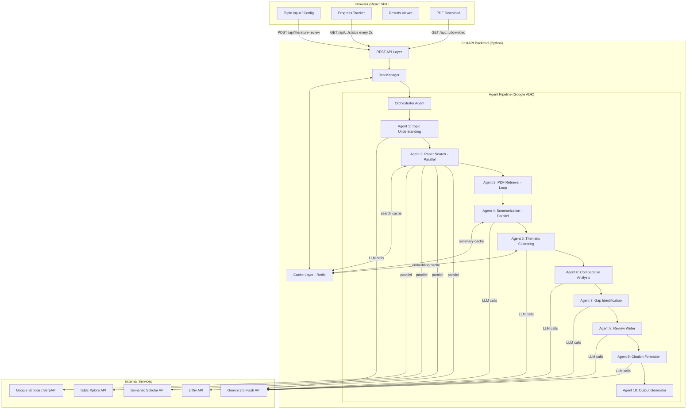

# Architecture

## System Overview

Three-tier architecture: React SPA → FastAPI Backend → Multi-Agent Pipeline.

```
Browser (React SPA)
    └─→ FastAPI Backend (Python / asyncio)
            ├─→ Job Manager (in-memory + Redis)
            ├─→ Cache Layer (Redis, 24h TTL)
            └─→ Agent Pipeline (Google ADK)
                    ├─→ External LLM (Gemini 2.5 Flash)
                    └─→ Academic APIs (arXiv, Semantic Scholar, IEEE, Scholar)
```

The client never holds an open connection during pipeline execution. It submits a job, receives a `job_id`, then polls `/status` every 2 seconds until completion.

---

## Architecture Diagram



---

## Agent Pipeline

The pipeline runs as a Google ADK `SequentialAgent` (the orchestrator) containing 10 specialized sub-agents. Each agent is a stateless async function: it receives immutable input and returns a new result without mutating shared state.

### Orchestrator (`agents/orchestrator.py`)

Coordinates the full pipeline for a given job. Instantiates each agent in order, threads the `AgentContext` (job ID, cache service, logger) through the chain, and reports stage progress to the `JobManager` after each agent completes. Applies the error-handling decision tree described below.

### Agent 1 — Topic Understanding (`agents/topic_understanding.py`)

Calls Gemini to decompose the user's topic into 3–5 focused search queries, identify key authors and venues, and extract domain vocabulary. Output is a `TopicUnderstanding` object consumed by Agent 2. Pipeline aborts if this agent fails — no downstream work is possible without search queries.

### Agent 2 — Paper Search (`agents/paper_search.py`)

Executes all four academic source searches **in parallel** using `asyncio.gather`: arXiv, Semantic Scholar, IEEE Xplore, and Google Scholar/SerpAPI. Results are deduplicated by DOI and normalized title before being passed forward. Partial success (≥1 source) is acceptable; failed sources are logged and skipped.

### Agent 3 — PDF Retrieval (`agents/pdf_retrieval.py`)

Iterates over the paper list (loop agent pattern) and attempts to download full-text PDFs from the paper's URL. Extracted text is attached to the `Paper` object as `full_text`. Papers where PDF retrieval fails are marked `abstract-only` and continue through the pipeline.

### Agent 4 — Summarization (`agents/summarization.py`)

Processes each paper **in parallel** using Gemini. Produces structured summaries: `micro_summary`, `long_summary`, `methodology`, `findings`, `contributions`, and `limitations`. Summary results are cached by paper DOI/ID to avoid redundant LLM calls on repeat runs.

### Agent 5 — Thematic Clustering (`agents/thematic_clustering.py`)

Generates sentence embeddings for each paper (via Gemini or a local embedding model), then applies k-means clustering (scikit-learn) to group papers into themes. Every paper is assigned to exactly one theme — the clustering produces a partition. Each theme gets a label and description generated by Gemini.

### Agent 6 — Comparative Analysis (`agents/comparative_analysis.py`)

Calls Gemini with a structured prompt comparing methodologies, findings, and approaches across papers within each theme. Produces a comparison matrix and a narrative `comparative_analysis` section for the final review. If this agent fails, the section is omitted and the pipeline continues.

### Agent 7 — Gap Identification (`agents/gap_identification.py`)

Calls Gemini to identify `ResearchGap` objects (methodological, empirical, theoretical, geographical) from the thematic summaries and comparative analysis. Each gap includes supporting evidence and suggested future research questions. If this agent fails, the gaps section is omitted.

### Agent 8 — Review Writer (`agents/review_writer.py`)

Calls Gemini to synthesize all prior outputs into a cohesive literature review: introduction, thematic analysis narrative, comparative analysis, gaps section, conclusion, and executive summary. Pipeline aborts if this agent fails — there is no output without the review text.

### Agent 9 — Citation Formatter (`agents/citation_formatter.py`)

Formats all referenced papers into the requested citation style (APA, Harvard, or IEEE). Produces the bibliography string and inline citation keys. Falls back to placeholder citations if formatting fails.

### Agent 10 — Output Generator (`agents/output_generator.py`)

Assembles the complete `LiteratureReview` object and generates the PDF using `reportlab`. Stores the PDF at a job-scoped path and records `pdf_path` on the result. If PDF generation fails, returns the review as Markdown text without a PDF.

---

## Data Flow

```
User input: topic string + ReviewConfig
    │
    ▼ Agent 1: Topic Understanding
    │   → TopicUnderstanding {search_queries, key_authors, domain_terms}
    │
    ▼ Agent 2: Paper Search (parallel across 4 sources)
    │   → list[Paper] (deduplicated, normalized)
    │
    ▼ Agent 3: PDF Retrieval (loop per paper)
    │   → list[Paper] (with full_text populated where available)
    │
    ▼ Agent 4: Summarization (parallel per paper)
    │   → list[Paper] (with micro_summary, long_summary, methodology, findings, ...)
    │
    ▼ Agent 5: Thematic Clustering
    │   → tuple[Theme, ...] (partition of all papers into labeled groups)
    │
    ▼ Agent 6: Comparative Analysis
    │   → comparative_analysis: str, comparison_matrix per theme
    │
    ▼ Agent 7: Gap Identification
    │   → tuple[ResearchGap, ...] (typed gaps with evidence + suggestions)
    │
    ▼ Agent 8: Review Writer
    │   → introduction, thematic_analysis, gaps_section, conclusion, executive_summary
    │
    ▼ Agent 9: Citation Formatter
    │   → bibliography: str, formatted per APA/Harvard/IEEE
    │
    ▼ Agent 10: Output Generator
        → LiteratureReview (complete domain object)
        → PDF file at job-scoped path
        → job marked completed, result stored in JobManager
```

---

## Key Design Decisions

### Frozen Dataclasses for Agent Isolation

All domain models (`Paper`, `Theme`, `ResearchGap`, `LiteratureReview`) are `@dataclass(frozen=True)`. Agents cannot mutate shared objects — each agent receives data and returns a new object. This eliminates an entire class of concurrency bugs and makes agent behavior easy to test in isolation.

### Job-Based Polling Model

Literature reviews take 60–120 seconds. Holding an HTTP connection open that long is fragile (proxies, load balancers, client timeouts). Instead, the API returns a `job_id` immediately (202 Accepted), and the client polls `/status` every 2 seconds. This decouples the client lifecycle from pipeline execution and makes the system resumable: a client can refresh the page and resume polling by job ID.

### Redis Caching

Three cache tiers, all with 24-hour TTL:
- **Search cache** (Agent 2): keyed by query string + source. Repeat topics skip network calls entirely.
- **Summary cache** (Agent 4): keyed by paper DOI or ID. Avoids re-summarizing the same paper across different review topics.
- **Embedding cache** (Agent 5): keyed by paper ID. Embedding generation is expensive; caching it saves ~0.5s per paper on cache hits.

The system falls back to an in-memory cache if Redis is unavailable, so it runs without infrastructure dependencies in development.

### Async-First

Every I/O-bound operation uses Python `asyncio`: LLM API calls, academic API calls, PDF downloads, cache reads/writes, and file I/O. `asyncio.gather` is used wherever operations are independent (Agent 2 source fan-out, Agent 4 per-paper summarization). This keeps the server non-blocking and allows a single uvicorn worker to handle multiple concurrent jobs.

---

## Directory Structure

```
literature-review-web-app/
├── backend/
│   ├── agents/                        # One module per agent + orchestrator
│   │   ├── orchestrator.py            # Pipeline coordinator; manages stage transitions
│   │   ├── topic_understanding.py     # Agent 1: query generation via Gemini
│   │   ├── paper_search.py            # Agent 2: parallel search across 4 sources
│   │   ├── pdf_retrieval.py           # Agent 3: per-paper PDF download loop
│   │   ├── summarization.py           # Agent 4: parallel per-paper LLM summarization
│   │   ├── thematic_clustering.py     # Agent 5: embedding + k-means clustering
│   │   ├── comparative_analysis.py    # Agent 6: cross-paper comparison via Gemini
│   │   ├── gap_identification.py      # Agent 7: research gap extraction via Gemini
│   │   ├── review_writer.py           # Agent 8: full review synthesis via Gemini
│   │   ├── citation_formatter.py      # Agent 9: APA/Harvard/IEEE bibliography generation
│   │   └── output_generator.py        # Agent 10: PDF assembly via reportlab
│   │
│   ├── tools/                         # Stateless utility functions used by agents
│   │   ├── arxiv_search.py            # arXiv API wrapper (arxiv>=2.1.0)
│   │   ├── semantic_scholar_search.py # Semantic Scholar API wrapper
│   │   ├── ieee_search.py             # IEEE Xplore REST API client (httpx)
│   │   ├── scholar_search.py          # SerpAPI / scholarly adapter
│   │   ├── pdf_extractor.py           # PDF text extraction (pypdf)
│   │   ├── clustering.py              # k-means wrapper (scikit-learn)
│   │   ├── citation_formatter.py      # Citation string formatting logic
│   │   └── pdf_generator.py           # reportlab PDF builder
│   │
│   ├── models/                        # Data models
│   │   ├── paper.py                   # Paper, Theme, ResearchGap, LiteratureReview (frozen dataclasses)
│   │   ├── job.py                     # Job, Stage enum, JobStatus
│   │   └── api.py                     # Pydantic request/response models
│   │
│   ├── services/                      # Application-layer services
│   │   ├── job_manager.py             # Job lifecycle: create, update, complete, fail, cancel
│   │   ├── cache_service.py           # Redis + in-memory fallback cache
│   │   └── pipeline_runner.py         # Async pipeline execution wrapper
│   │
│   ├── api/                           # HTTP layer
│   │   ├── routes/
│   │   │   ├── literature_review.py   # POST/GET /api/literature-review/* endpoints
│   │   │   └── health.py              # GET /api/health
│   │   └── middleware.py              # CORS, correlation ID injection, request logging
│   │
│   ├── config/
│   │   ├── settings.py                # Pydantic Settings; reads from .env
│   │   └── logging_config.py          # Structured logging setup
│   │
│   ├── utils/
│   │   ├── retry.py                   # Exponential backoff decorator (max 3 attempts)
│   │   ├── deduplication.py           # DOI + normalized-title dedup logic
│   │   └── correlation.py             # Correlation ID middleware helper
│   │
│   ├── tests/
│   │   ├── unit/                      # Example-based tests for individual modules
│   │   ├── property/                  # Hypothesis property-based tests
│   │   └── integration/               # Full API tests with mocked external services
│   │
│   ├── main.py                        # FastAPI app factory and startup events
│   └── requirements.txt
│
├── frontend/
│   ├── src/
│   │   ├── components/
│   │   │   ├── TopicForm.tsx          # Topic input + config controls
│   │   │   ├── ProgressTracker.tsx    # Stage progress display with polling
│   │   │   ├── ResultsViewer.tsx      # Rendered review with section navigation
│   │   │   └── ErrorBanner.tsx        # API and network error display
│   │   ├── hooks/
│   │   │   └── useJobPoller.ts        # Polling hook (GET /status every 2s)
│   │   ├── api/
│   │   │   └── client.ts              # Typed axios API client
│   │   ├── App.tsx
│   │   └── main.tsx
│   ├── package.json
│   └── vite.config.ts
│
├── .env.example                       # Environment variable template
└── README.md
```
